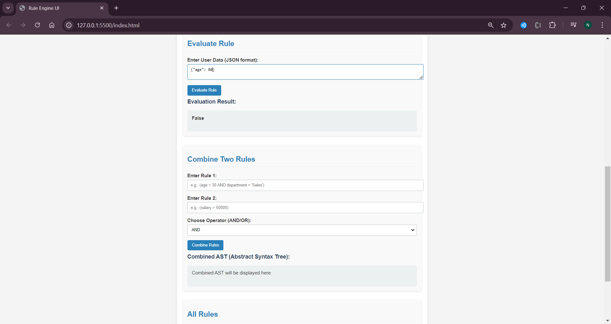

An app where you can ceate, combine, evaluate and view rules in the form of an abstract syntax tree.

## Tech Stack
The backend is built with Spring Boot, while the frontend utilizes JavaScript. The database in use is MySQL.

## Pre-Requisite - 
1. An IDE of your choice (IntelliJ used here)
2. Java (min v17)
3. Maven
4. MYSQL Workbench
   
## How to Run -
1. Clone repo using  `https://github.com/Neel901/RuleEngine.git`
2. To run the db:
    1. Connect to mysql server at `localhost:3306`
    2. Create database & table using `db.sql` file.
3. To run the server:
    1. Import the `RuleEngine` directory in IntelliJ or Eclipse.
    2. Run `mvn clean install`
    3. Add run/debug configurations in IntelliJ.
    4. Add a new configuration for Application as shown -
    5. 
    6. Run the server
    7. Use the curl to verify the server is up `curl --location 'localhost:8080/actuator/health'`
    8. Postman collection added at `ruleengine.postman_collection.json`.
4. To run the frontend:
    1. Open the `frontend` directory in VS Code.
    2. Make sure you have `Live Server` extension added in VS Code.
    3. Now open `frontend/index.html` file with `Live Server`.
    4. You should be seeing rule engine ui now.

## Enhancements - 
1. Equipped with graceful error response handling.
2. Logging enabled.
3. Added actuator health check.
4. Added request field validations.